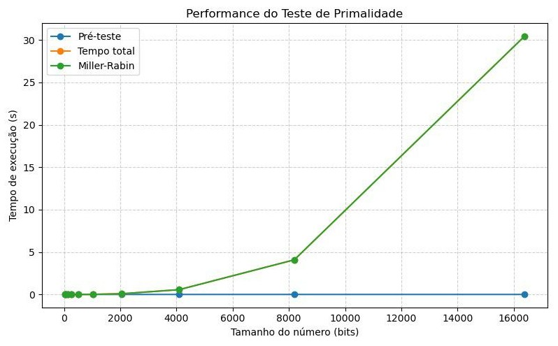
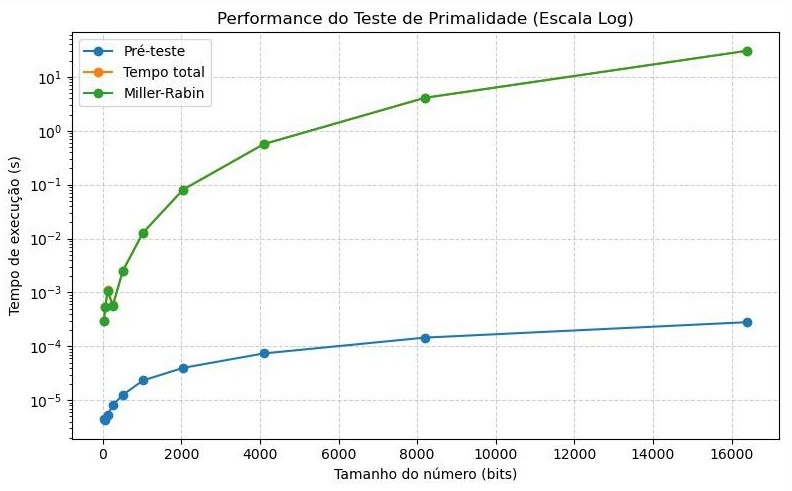

# 🔐 Teste de Primalidade de Miller-Rabin

Este repositório apresenta uma implementação do Teste de Miller-Rabin, um dos algoritmos probabilísticos mais importantes da Teoria dos Números e da Criptografia Moderna. O projeto foi desenvolvido como atividade da disciplina Fundamentos de Matemática para Ciência da Computação II (FMCC II) da UFCG.

**🔗 Vídeo explicativo: https://youtu.be/HwLEF9sOifg**

## Sobre o Projeto

O Teste de Miller-Rabin é utilizado para verificar se um número é provavelmente primo.
Diferente de métodos simples, como divisão por tentativa, esse algoritmo é capaz de trabalhar com números extremamente grandes (*Big Integers*) de forma rápida e eficiente. Por isso, ele é amplamente utilizado em aplicações reais, principalmente na **geração de chaves criptográficas**.

### Por que utilizar o Miller-Rabin?

- **Alta eficiência:**   
   Muito mais rápido do que testes determinísticos para números grandes.

- **Confiabilidade controlada:**  
  O erro do algoritmo depende apenas do número de iterações ($k$).
  A probabilidade de um número composto ser classificado como primo é menor que $4^{-k}$

- **Aplicação prática real:**   
  O teste é utilizado diretamente na geração de chaves do algoritmo RSA.

## ⚙️ Funcionalidades

  1. Implementação completa do teste de Miller-Rabin
  2. Pré-teste de primalidade para otimizar o desempenho
  3. Benchmark de performance para números grandes
  4. Testes de estresse
  5. Testes com números de Carmichael (para analisar falsos positivos)
  6. Geração de gráficos de desempenho

## 📘 Fundamentos Matemáticos
O teste baseia-se na decomposição de um número ímpar $n-1$ na forma:
$$n - 1 = 2^s \cdot d$$
Onde $d$ é ímpar.

Para um número ser considerado primo em relação a uma base $a$ (testemunha), uma das seguintes condições de congruência deve ser satisfeita:

1.  $a^d \equiv 1 \pmod{n}$
2.  $a^{2^r \cdot d} \equiv -1 \pmod{n}$ para algum $0 \le r < s$

## 📊 Benchmark e Análise de Performance

Para avaliar a eficiência da implementação, foram realizados testes de desempenho considerando:

- **Escalabilidade:**  
  Análise do tempo de execução conforme aumenta o número de bits do número testado.

- **Precisão vs Tempo:**  
  Estudo do impacto do número de iterações ($k$) no tempo total de execução.

- **Comparação de etapas:**  
  Diferença de desempenho entre o pré-teste de primalidade e o teste de Miller-Rabin.


| Escala normal | Escala logarítmica |
|--------------|-------------------|
|  |  |

> Os resultados mostram que o algoritmo mantém uma performance estável mesmo para números extremamente grandes, tornando-o ideal para aplicações criptográficas.

## ▶️ Como Executar

### 1. Clone o repositório

```bash
git clone https://github.com/rebecamdrs/teste-miller-rabin.git
cd teste-miller-rabin
```

### 2. Instale as dependências

```bash
pip install -r requirements.txt
```

### 3. Execute o programa

```bash
cd src/teste_primalidade
python main.py
```

## 🧪 Executar os testes

### Benchmark de performance
```bash
python testes/benchmark.py
```

### Teste de estresse
```bash
python testes/teste_estresse.py
```
### Testes básicos (primos conhecidos + Carmichael)
```bash
python testes/testes_basicos.py
```

## 📜 Créditos

| Nome             | GitHub                                                     |
| ---------------- | ---------------------------------------------------------- |
| Gabriela Ramalho | [@gabriela-gabriela](https://github.com/gabriela-gabriela) |
| Lara Soares      | [@lgiovannadms](https://github.com/lgiovannadms)           |
| Murilo Jadson    | [@Murilo-Jadson](https://github.com/Murilo-Jadson)         |
| Rebeca Medeiros  | [@rebecamdrs](https://github.com/rebecamdrs)               |
| Stefany Alves    | [@stnalves](https://github.com/stnalves)                   |
